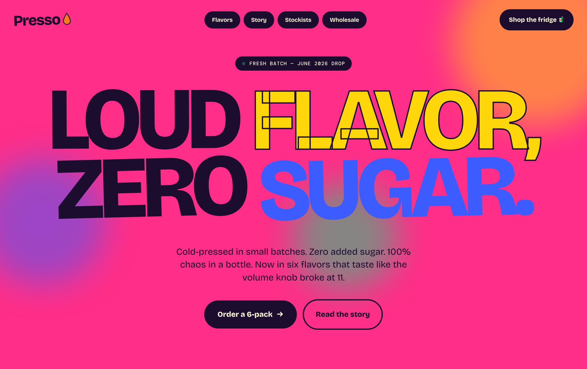

<div align="center">

# Presso — *Loud flavor, zero sugar.*

A high-fidelity, single-page marketing landing site for **Presso**, a fictional cold-pressed juice brand with a loud, brutalist personality.




</div>

---

## Overview

Presso is a scroll-driven landing page built as a **single, self-contained `index.html`** — no framework, no bundler, no dependencies. The design leans into deliberate "wonkiness": a hot-magenta canvas, per-word headline colors, hard offset shadows (never blurred), a tilted infinite marquee, spinning stickers, and collectible-style product cards. Every rotation and offset is intentional.

It was produced as an **agentic build**: the visual direction was generated with **Claude Fable 5**, then implemented and refined by an autonomous coding agent running a **self-verifying loop** — rendering each change in a real browser and checking it against the design before moving on. See [How it was built](#how-it-was-built).

## Live preview

Because the site is a single static file with zero dependencies, you can run it any of these ways:

```bash
# 1. Just open it
open index.html

# 2. Or serve it locally (recommended — keeps relative asset paths clean)
python3 -m http.server 8731
# then visit http://localhost:8731/index.html
```

> Deployable as-is to any static host — GitHub Pages, Netlify, Vercel, or Cloudflare Pages. No build command required.

## Features

- **Zero dependencies** — one HTML file, all CSS in a single `<style>` block, ~30 lines of vanilla JS.
- **Loud brutalist design system** — hot-magenta canvas, hard `Npx Npx 0` offset shadows, `99px` pills, `3–6px` ink borders.
- **Per-word display type** — the hero headline colors and animates each word independently.
- **Motion, considered** — scroll-reveal (IntersectionObserver), infinite marquee, floating background blobs, spinning stickers, headline wiggle — all disabled under `prefers-reduced-motion`.
- **Collectible product cards** — per-flavor accent colors, corner number stickers, category tags, ratings, per-bottle pricing, and animated CTAs.
- **Accessible by default** — visible keyboard focus rings, reduced-motion support, semantic landmarks, `aria-hidden` on decorative motion.
- **Responsive** — a single `≤780px` breakpoint collapses the nav, flavor grid, and footer.
- **Full favicon set** — SVG + `.ico` + Apple touch icon + `theme-color`.

## Tech stack

| Layer | Choice |
| --- | --- |
| Markup | Semantic HTML5 |
| Styling | Hand-authored CSS (custom properties, grid, clamp) — no preprocessor |
| Scripting | Vanilla JS (`IntersectionObserver` scroll-reveal only) |
| Type | [Bricolage Grotesque](https://fonts.google.com/specimen/Bricolage+Grotesque) + [DM Mono](https://fonts.google.com/specimen/DM+Mono) (Google Fonts) |
| Build | **None** — open the file |

## Project structure

```
presso-landing/
├── index.html                 # The entire site (markup + CSS + JS)
├── favicon.svg                # Brand droplet mark (scalable)
├── favicon.ico                # 16/32/48px fallback
├── apple-touch-icon.png       # 180×180 iOS home-screen icon
├── assets/
│   └── img/
│       ├── 03-pulpa-splash.jpg   # Hero + Orange Riot photo
│       └── 03-pulpa-bottle.jpg   # Berry Brawl photo
└── docs/
    ├── DESIGN-SPEC.md         # Full design handoff spec (tokens, sections, motion)
    └── preview.png            # Hero preview used in this README
```

## Design system

The complete, canonical specification — every color token, type ramp, radius, shadow, rotation, animation timing, and responsive rule — lives in **[`docs/DESIGN-SPEC.md`](docs/DESIGN-SPEC.md)**. Highlights:

**Palette**

| Token | Hex | Role |
| --- | --- | --- |
| `--pink` | `#ff2e88` | Page background, marquee dots |
| `--yellow` | `#ffd60a` | Accent — stickers, highlight badge |
| `--blue` | `#3d5cff` | "SUGAR." word, `chaos.` emphasis |
| `--green` | `#0fdc7f` | Status dot, sticker, Green Scream |
| `--orange` | `#ff7a1a` | Brand droplet, Orange Riot accent |
| `--cream` | `#fff4d6` | Text on dark fills |
| `--ink` | `#1a0d2e` | Text, borders, dark sections |

**Rules of the house:** shadows are hard offsets, never blurred (`8px 8px 0` resting → `14px 14px 0` on hover). All pills use `border-radius: 99px`. Stickers spin to `348deg`, not `360deg`, to avoid a visible reset snap.

## How it was built

This project is a case study in **agentic, self-verifying front-end development**:

1. **Design direction — Claude Fable 5.** The brand's visual language (palette, type pairing, brutalist signature) was explored and generated with Fable 5, then locked into a written design spec.
2. **Agentic implementation loop.** An autonomous coding agent (Claude Code) drove the build in a closed loop:
   `propose change → apply → render in a real browser → screenshot → compare against the design intent → correct → repeat.`
3. **Self-verification, not assumption.** Every visual change was **validated by rendering and screenshotting** — via live browser automation and headless Chrome — rather than assumed from the diff. Regressions (e.g. an oversized card badge, a washed-out image filter) were caught by looking at the actual output, then fixed and re-verified.
4. **Quality floor, enforced.** Reduced-motion handling, focus states, and the responsive breakpoint were treated as part of "done," not afterthoughts.

The result is a pixel-intentional page where the loud, off-kilter details are the design — verified against reference, not left to chance.

## Accessibility

- Visible keyboard focus rings (`3px` yellow outline) on every interactive element.
- All motion (marquee, spin, wiggle, float, blink, reveal) is disabled under `@media (prefers-reduced-motion: reduce)`.
- Decorative motion layers carry `aria-hidden="true"`; the page reads cleanly in DOM order.
- Core color pairings clear WCAG AA contrast.

## Roadmap

- [ ] Mobile navigation menu (nav links currently hide below `780px`).
- [ ] Convert product photos to WebP/AVIF with `srcset` + lazy-loading.
- [ ] Replace the Green Scream emoji placeholder with a real product photo.
- [ ] Wire "Add to fridge" / "Order a 6-pack" to a commerce backend.
- [ ] Swap placeholder review counts for real data (or remove).

## Deployment

Any static host works. For **GitHub Pages**: push to `main`, then enable Pages (Settings → Pages → deploy from `main` / root). The site is served directly from `index.html`.

## License

Released under the [MIT License](LICENSE). *Presso is a fictional brand created for design/portfolio purposes.*

## Author

**Mejba Ahmed** — built with an agentic loop, verified in the browser, designed with Claude Fable 5.
